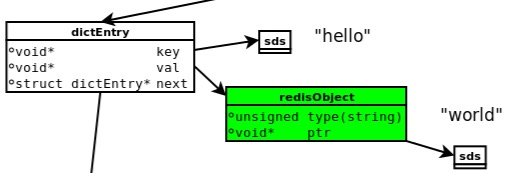

<!-- TOC -->

- [概览](#%E6%A6%82%E8%A7%88)
  - [1 简介和应用](#1-%E7%AE%80%E4%BB%8B%E5%92%8C%E5%BA%94%E7%94%A8)
  - [2 redis的对象redisObject](#2-redis%E7%9A%84%E5%AF%B9%E8%B1%A1redisobject)
  - [3 String](#3-string)
  - [4 List](#4-list)
    - [4.1 linkedlist(双端列表)](#41-linkedlist%E5%8F%8C%E7%AB%AF%E5%88%97%E8%A1%A8)
    - [4.2 ziplist(压缩列表)](#42-ziplist%E5%8E%8B%E7%BC%A9%E5%88%97%E8%A1%A8)
    - [4.3 quickList](#43-quicklist)
  - [5 Hash](#5-hash)
  - [6 Set](#6-set)
  - [7 Zset](#7-zset)

<!-- /TOC -->

# 概览

## 1 简介和应用

Redis 是Ansi C撰写的，性能优秀，支持网络、可持久化的K-K内存数据库。支持多种语言，主要的存储格式为以下五种

|数据类型|可存储的值|操作|
|--|:--|--|
|字符串、整数或浮点数|对整个字符串或者部分字符串操作，自增或自减|
|LIST|链表|从两端压入或者弹出元素，读取单个或者多个元素，进行修改，只保留一部分元素|
|包含键值对的无序散列表|添加、获取、移除单个键值对，获取所有键值对，检查某个键是否存在|
|SET|无序集合|添加、获取、移除单个元素，检查一个元素是否存在于集合中，计算交集、差集并集；从集合中随机获取元素|
|ZSET|有序集合|添加、获取、删除元素，根据范围来获取元素，计算一个键的排名|

Redis一般在互联网公司有如下应用:

* String : 缓存、限流、计数器、分布式锁、分布式session
* Hash : 存储用户信息、用户主页访问量、组合查询
* List : 微博关注人时间轴列表；简单队列
* Set : 赞、踩、标签、好友关系
* Zset : 排行表

比如在电商网站中通过redis做库存的扣除、然后通过日志驱动数据的存储

## 2 redis的对象redisObject

当我们执行 set hello world时，会有如下的数据模型:



* dictEntry：Redis给每个key-value键值对分配一个dictEntry，里面有着key和val的指针，next指向下一个dictEntry形成链表，这个指针可以将多个哈希值相同的键值对链接在一起，由此来解决哈希冲突问题(链地址法)。
* sds：键key“hello”是以SDS（简单动态字符串）存储，后面详细介绍。
* redisObject：值val“world”存储在redisObject中。实际上，redis常用5中类型都是以redisObject来存储的；而redisObject中的type字段指明了Value对象的类型，ptr字段则指向对象所在的地址。

redisObject对象非常重要，Redis对象的类型、内部编码、内存回收、共享对象等功能，都需要redisObject支持。这样设计的好处是，可以针对不同的使用场景，对5中常用类型设置多种不同的数据结构实现，从而优化对象在不同场景下的使用效率。

无论是dictEntry对象，还是redisObject、SDS对象，都需要内存分配器（如jemalloc）分配内存进行存储。jemalloc作为Redis的默认内存分配器，在减小内存碎片方面做的相对比较好。比如jemalloc在64位系统中，将内存空间划分为小、大、巨大三个范围；每个范围内又划分了许多小的内存块单位；当Redis存储数据时，会选择大小最合适的内存块进行存储。

前面说过，Redis每个对象由一个redisObject结构表示，它的ptr指针指向底层实现的数据结构，而数据结构由encoding属性决定。比如我们执行以下命令得到存储“hello”对应的编码：

```
$ set hello world
OK
$ object encoding hello
"embstr"
```

Object有如下的编码方式:

|对象所使用的底层数据结构|编码常量|Object Encoding输出值|
|:--|:--:|:--|
|整数|REDIS_ENCODING_INT|"int"|
|embstr编码的简单动态字符串 SDS|REDIS_ENCODING_EMBSTR|"embstr"|
|简单动态字符串|REDIS_ENCODING_RAW|"raw"|
|字典|REDIS_ENCODING_HT|"hashTable"|
|双端链表|REDIS_ENCODING_LINKEDLIST|"quicklist"|
|压缩列表|REDIS_ENCODING_ZIPLIST|"quicklist"|
|整数集合|REDIS_ENCODING_INTSET|"intset"|
|跳跃表和字典|RESID_ENCODING_SKIPLIST|"skiplist"|

## 3 String

字符串底层存储可以使用int、raw和embstr。embstr是通过内存分配函数一次分配内存。但是raw要分配两次

int编码字符串对象和embstr编码字符串对象在一定条件下会转化为raw编码字符串对象。embstr：<=39字节的字符串。int：8个字节的长整型。raw：大于39个字节的字符串。

简单动态数组(SDS) 更像是C++中的String或者Java中的ArrayList<Character>,长度动态可变

```
struct sdshdr {
    // buf 中已占用空间的长度
    int len;
    // buf 中剩余可用空间的长度
    int free;
    // 数据空间
    char buf[]; // ’\0’空字符结尾
};
```

常数复杂度获取字符串长度:因为数据结构中存储了长度，所以时间复杂度为O(1)

预分配空间:如果对一个SDS进行修改，分为两种情况

* SDS长度小于1M，那么程序将分配和len属性同样大小的未使用空间
* SDS长度大于1M，那么程序将继续分配1M的空间使用

惰性释放空间: 当对SDS进行了sdstrim(字符串截取)之后，sds不会立马释放空间，这样对于未来的内存开辟来说可以节省不少的工作量

杜绝缓冲区溢出: SDS由于记录了长度，相应的操作在可能造成缓冲区溢出时会自动重新分配内存，杜绝了缓冲区溢出。

## 4 List

List元素的底层实现是使用了quickList(快速列表、是zipList和linkedlist的组合)。Redis中的列表支持从两端插入或者弹出，并可以获得指定位置的元素，那么他可以充当数组、队列或栈

```
typedef struct listNode {
     // 前置节点
    struct listNode *prev;
    // 后置节点
    struct listNode *next;
    // 节点的值
    void *value;
 } listNode;

 typedef struct list {
     // 表头节点
    listNode *head;
    // 表尾节点
    listNode *tail;
    // 节点值复制函数
    void *(*dup)(void *ptr);
    // 节点值释放函数
    void (*free)(void *ptr);
     // 节点值对比函数
    int (*match)(void *ptr, void *key);
     // 链表所包含的节点数量
    unsigned long len;
 } list;
```

* rpush: listAddNodeHead ---O(1)
* lpush: listAddNodeTail ---O(1)
* push:listInsertNode ---O(1)
* index : listIndex ---O(N)
* pop:ListFirst/listLast ---O(1)
* llen:listLength ---O(N)

### 4.1 linkedlist(双端列表)

此结构类似于Java的LinkedList

与双端链表相比，压缩列表可以节省内存空间，但是进行修改或增删操作时，复杂度较高；因此当节点数量较少时，可以使用压缩列表；但是节点数量多时，还是使用双端链表划算。

### 4.2 ziplist(压缩列表)

当一个列表键只包含少量的列表项，并且是小整数或者长度比较短的字符串时，那么redis就使用zipList来做底层的存储。ziplist的存在意义是压缩占用的空间，节约内存

### 4.3 quickList

quickList 是 zipList 和 linkedList 的混合体。它将 linkedList 按段切分，每一段使用 zipList 来紧凑存储，多个zipList 之间使用双向指针串接起来。因为链表的附加空间相对太高，prev 和 next 指针就要占去 16 个字节 (64bit 系统的指针是 8 个字节)，另外每个节点的内存都是单独分配，会加剧内存的碎片化，影响内存管理效率。

quicklist 默认的压缩深度是 0，也就是不压缩。为了支持快速的 push/pop 操作，quicklist 的首尾两个 ziplist 不压缩，此时深度就是 1。为了进一步节约空间，Redis 还会对 ziplist 进行压缩存储，使用 LZF 算法压缩。

## 5 Hash

* Hash的底层存储是zipList或hashtable  
* Hash对象只有同时满足下面两个条件时，才会使用ziplist（压缩列表）：1.哈希中元素数量小于512个；2.哈希中所有键值对的键和值字符串长度都小于64字节。
* hashtable哈希表可以实现O(1)复杂度的读写操作，因此效率很高。
* hashtable和JDK1.6中的HashMap类似，采用动态数组+链表的方式实现
* Redis中的字典使用hashtable作为底层实现的话，每个字典会带有两个哈希表，一个用来使用，一个用来reHash

## 6 Set

* Set的底层存储是用的intset或hashtable
* intset（整数集合）当一个集合只含有整数，并且元素不多时会使用intset（整数集合）作为Set集合对象的底层实现。

```
typedef struct intset {
    // 编码方式
    uint32_t encoding;
    // 集合包含的元素数量
    uint32_t length;
    // 保存元素的数组
    int8_t contents[];
} intset;
```

* sadd:intsetAdd---O(1)
* smembers:intsetGetO(1)---O(N)
* srem:intsetRemove---O(N)
* slen:intsetlen ---O(1)

## 7 Zset

* ZSet有序集合对象底层实现可以是ziplist（压缩列表）或者skiplist（跳跃表）。
* 当一个有序集合的元素数量比较多或者成员是比较长的字符串时，Redis就使用skiplist（跳跃表）作为ZSet对象的底层实现。
* skiplist的查找时间复杂度是LogN，可以和平衡二叉树相当，但实现起来又比它简单。跳跃表(skiplist)是一种有序数据结构，它通过在某个节点中维持多个指向其他节点的指针，从而达到快速访问节点的目的。